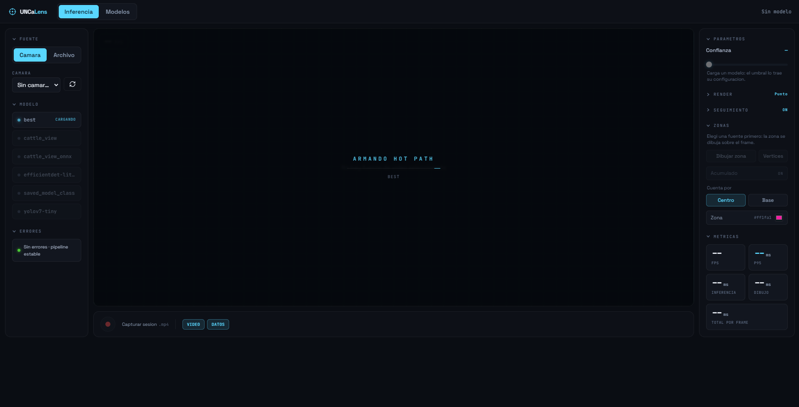
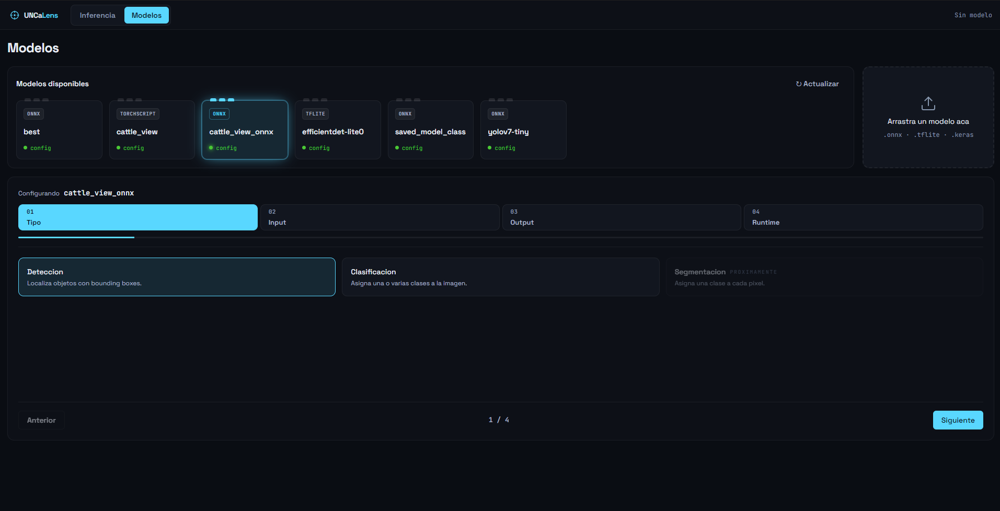

# UNCaLens — Interfaz modular de visión por computadora

Aplicación de escritorio (Electron + FastAPI) para ejecutar modelos de visión sobre
cámara en vivo, videos e imágenes, sin escribir código para cada modelo nuevo.

La idea central: el backend es agnóstico al framework. Un modelo no se "programa", se
describe con un JSON (`configs/<nombre>.json`) que declara cómo preprocesar la entrada,
cómo desempaquetar el tensor de salida y con qué runtime ejecutarlo. Agregar un modelo cuyo
formato ya está soportado es escribir ese JSON desde el wizard de la app — cero Python.

---


https://github.com/user-attachments/assets/d95da196-59f0-4d70-acf8-88f3eaf8263f


---

<table>
  <tr>
    <td width="50%">
      
    </td>
    <td width="50%">
      
    </td>
  </tr>
</table>

---

## Estado actual

| Área | Estado |
|---|---|
| Detección de objetos |  Funcional (YOLOv7-tiny ONNX, EfficientDet-lite0 TFLite) |
| Clasificación |  Funcional (InceptionV4 ONNX, 1103 clases multi-etiqueta) |
| Segmentación |  No implementada — la API responde `501` honesto |
| Frontend React + Electron |  Operativo, verificado en dev y en build `file://` |
| Aceleración por GPU |  CUDA 12 vía ONNX Runtime (**CUDA viene por pip, no se instala en el sistema**) |
| Cámara en vivo |  Implementada, no verificada contra hardware real |
| Empaquetado / instalador |  Pendiente (hoy corre desde el repo con su venv) |

82 tests verdes (unitarios + end-to-end real contra los tres modelos).

---

## Cómo funciona

```
  ┌──────────────────────────┐            ┌──────────────────────────────────────┐
  │ Cliente (React/Electron) │   frame    │   Backend (FastAPI, Python 3.12)     │
  │                          │   JPEG     │                                      │
  │ webcam / video / imagen  ├──binario──►│  preprocess → adapter → predict       │
  │                          │            │      → unpack → postprocess           │
  │ canvas: frame + cajas    │◄───JSON────┤                                      │
  └──────────────────────────┘  envelope  └──────────────────────────────────────┘
```

El cliente es un thin client: captura frames, los manda por WebSocket y dibuja el
resultado. No toca el disco — todo (listar modelos, leer/escribir configs, subir pesos)
va por HTTP al backend.

El backend devuelve un envelope etiquetado por cada frame recibido, siempre, incluso
ante error (romper ese "siempre responde" reintroduce un deadlock del stream):

```jsonc
// detección
{ "task": "detection",      "result": [[x1, y1, x2, y2, conf, cls], ...], "error": null }
// clasificación
{ "task": "classification", "result": [{ "cls": 663, "score": 0.61 }, ...], "error": null }
// error
{ "task": null, "result": null, "error": "no_model" }   // frame_invalido | inference_error
```

El formato interno estándar de una detección es `[x1, y1, x2, y2, conf, cls]` en píxeles
de la imagen original (letterbox ya deshecho).

### El pipeline, paso a paso

1. **preprocess** — letterbox/resize + normalización fusionada → `(tensor, meta)`
2. **input adapter** — `color_order` (RGB/BGR), `layout` (HWC/CHW/NHWC/NCHW), `dtype`
3. **predict** — el runtime del backend elegido
4. **unpack** — tensor crudo → matriz `(N,6)` (detección) o vector `(C,)` (clasificación)
5. **output adapter** — reordena columnas al formato estándar (solo si el `pack_format` lo necesita)
6. **postprocess** — filtro de confianza → top-k → NMS → deshacer letterbox → orden por score

El estado por frame viaja en el dict `meta`, no en el controller: cada inferencia es
autocontenida y varios frames pueden correr en paralelo.

---

## Requisitos

- **Python 3.12** (probado en 3.12.10)
- **Node.js 18+**
- **Driver NVIDIA** con soporte CUDA ≥ 12.0 (`nvidia-smi` para verificar) — **opcional**:
  sin GPU el sistema corre en CPU, más lento.

> **CUDA y cuDNN no se instalan en el sistema.** Vienen como wheels `nvidia-*-cu12` dentro
> del venv (~1,1 GB), arrastradas por el extra `[cuda,cudnn]` de `onnxruntime-gpu`. Lo
> único del sistema es el driver.

---

## Instalación

```bash
git clone https://github.com/GallitoGod/UNCa-Interfaz.git
cd UNCa-Interfaz

# 1. Dependencias de Node
npm install

# 2. Entorno de Python (el nombre .venv importa: Electron lo busca por default)
py -3.12 -m venv .venv          # Windows
.venv\Scripts\activate
# python3.12 -m venv .venv && source .venv/bin/activate    # Linux/macOS

# 3. Dependencias del backend
pip install -r requirements.txt
```

`requirements.lock.txt` es el freeze exacto del entorno de referencia (93 paquetes,
solo-Windows) si necesitás reproducirlo bit a bit.

---

## Ejecución

```bash
# Todo-en-uno: Electron levanta uvicorn solo y lo mata al salir
npm run build && npm start

# Desarrollo con HMR (dos terminales)
npm run dev          # dev server de Vite en :5173
npm run start:dev    # Electron apuntando al dev server
```

Para trabajar sobre el backend con reload, conviene lanzarlo a mano:

```bash
# UNCA_NO_SPAWN=1 evita que Electron levante un segundo uvicorn
uvicorn api.mainAPI:app --host 127.0.0.1 --port 8000 --app-dir src
```

Variables de escape: `UNCA_NO_SPAWN=1` (no spawnear backend) y `UNCA_PYTHON=<ruta>`
(forzar intérprete; por default usa el `.venv` del repo y si no, el `python` del PATH).


### Tests

```bash
pytest                                                          # 82 tests
pytest --ignore=src/api/func/tests/test_end_to_end_yolov7.py    # solo unitarios

npm run typecheck    # frontend: no hay runner de tests, se valida con tsc + build
npm run build
```

---

## Configurar un modelo

Un modelo = un archivo de pesos en `models/` + un JSON en `configs/` con el mismo
nombre base. El JSON se valida contra un schema estricto de Pydantic
(`extra="forbid"`): un campo desconocido o mal escrito es un error de carga visible, no un
silencio. La app trae un wizard de 4 pasos que lo genera y lo guarda por HTTP.

```jsonc
{
  "model_type": "detection",              // detection | classification | segmentation
  "input": {
    "width": 640, "height": 640, "channels": 3,
    "normalize": true, "scale": true,     // /255 + (x - mean) / std, fusionados
    "mean": [0, 0, 0], "std": [1, 1, 1],
    "letterbox": true,                    // con relleno gris, deshecho en el postproceso
    "auto_pad_color": [114, 114, 114],
    "color_order": "RGB",
    "input_str": { "layout": "NCHW", "dtype": "float32" }
  },
  "output": {
    "pack_format": "raw",                 // ← la clave: qué forma tiene el tensor crudo
    "confidence_threshold": 0.25,         // editable en vivo desde el slider
    "apply_nms": false, "nms_threshold": 0.45, "top_k": 0,
    "tensor_structure": {                 // qué columna es qué
      "box_format": "xyxy",
      "coordinates": { "x1": 1, "y1": 2, "x2": 3, "y2": 4 },
      "confidence_index": 6, "class_index": 5, "num_classes": 80
    }
  },
  "runtime": {
    "backend": "onnxruntime", "device": "gpu",
    "onnx": { "providers": ["CUDAExecutionProvider", "CPUExecutionProvider"] },
    "warmup": { "enabled": true, "runs": 0 }
  }
}
```

Hay plantillas de ejemplo en `configs/plantillas/` (no se listan como modelos cargables).

### Formatos soportados

Runtimes (`runtime.backend`): `onnxruntime` (`.onnx`), `tflite` (`.tflite`),
`keras` (`.h5`, `.keras`), `pytorch` (`.pt`, `.pth`).

Desempaquetadores (`output.pack_format`) — el mapeo tensor crudo → formato interno:

| `pack_format` | Familia | Para qué |
|---|---|---|
| `raw` | detección | Tensor plano `(N,K)` con columnas declaradas en `tensor_structure` |
| `yolo_flat` | detección | Salida YOLO aplanada, con objectness × class scores |
| `boxes_scores` | detección | Tensores separados de cajas y puntajes (ya en formato estándar) |
| `tflite_detpost` | detección | Op `DetectionPostProcess` de TFLite (trae NMS y umbral aplicados) |
| `anchor_deltas` | detección | Cabeza cruda anchor-based (EfficientDet / SSD); requiere `anchor_config` |
| `softmax_out` / `sigmoid_out` / `logits_raw` | clasificación | Según qué activación traiga ya aplicada el modelo |

> Los `.tflite` de EfficientDet exportan la cabeza cruda (anchors + deltas), no el op de
> postproceso. Configurarlos como `boxes_scores` produce cajas basura — hay que usar
> `anchor_deltas` con su `anchor_config`. La tabla de anchors se genera al cargar el modelo.

---

## API HTTP

| Método | Ruta | Descripción |
|---|---|---|
| `GET` | `/get_models` | Configs que tienen pesos en `models/` — los cargables para el selector |
| `GET` | `/models` | Todos los pesos con `{file, ext, baseName, hasConfig}` — para la vista Modelos |
| `POST` | `/select_model` | `{model_name}` → carga + validación post-carga. `404`/`422`/`501` honestos |
| `POST` | `/model/load` | Carga por ruta directa |
| `POST` | `/model/unload` | Libera el pipeline |
| `POST` | `/config/confidence` | `{value: 0..1}` → umbral en vivo. `409` sin modelo, `422` fuera de rango |
| `GET` | `/config/template/{model_type}` | Defaults del schema por tipo (single source of truth del wizard) |
| `GET` / `POST` | `/configs/{name}` | Lee / valida y escribe `configs/<name>.json` |
| `POST` | `/models/upload` | Sube un peso por multipart (valida extensión y nombre antes del stream) |
| `WS` | `/video_stream` | JPEG binario in → envelope JSON out (1 frame en vuelo) |
| `GET` | `/logs/inference` | Últimos 50 errores de inferencia |
| `GET` | `/metrics` | avg / p95 / fps + desglose pre / inferencia / post |

La carga de modelo es atómica: arma todo el pipeline en locales y recién al final hace
commit; ante cualquier fallo el controller queda descargado y el error se propaga con su
código HTTP real. Después de cargar corre una inferencia dummy end-to-end
(`validate_pipeline`).

---

## Estructura del repositorio

```
src/
├── main.js                  Electron: ventana con hardening (contextIsolation + sandbox)
├── backend-process.js       Arranca y mata uvicorn desde Electron
├── preload.js               contextBridge VACÍO — el cliente no toca disco
└── api/
    ├── mainAPI.py           Endpoints FastAPI + WS /video_stream
    └── func/
        ├── model_controller.py   Manager puro: elige estrategia, invoca runner, mide
        ├── tasks/                Seam por model_type: detection / classification / segmentation
        ├── reader_pipeline/      Schema Pydantic estricto + loaders por runtime (forms/)
        ├── input_pipeline/       Preprocesador y adaptador de entrada
        └── output_pipeline/      Unpackers, adaptador de salida, postprocesadores

client/                      Frontend React (Feature-Driven: app/ features/ shared/)
  └── features/vision-workspace/services/   Una estrategia de render por tipo de tarea
configs/                     Un JSON por modelo (+ plantillas/)
models/                      Pesos
logs/                        Un .log rotativo por modelo (512 KB × 3)
docs/                        Documentación de arquitectura, specs y planes
```

El punto de extensión es `tasks/`: agregar un tipo de modelo es agregar una
`TaskStrategy` (`build_pipeline` + `serialize`) y su servicio de render en el cliente. La
clasificación se implementó así, sin tocar el controller, el WebSocket ni el transporte
del cliente.

**Stack**: Python 3.12.10 · FastAPI · ONNX Runtime 1.26 (CUDA 12) · TensorFlow 2.21 ·
PyTorch 2.13 · OpenCV 5 · NumPy 2.5 — React 19 · Vite 6 · TypeScript · Zustand ·
TanStack Query · Tailwind 4 · Electron 32.

---

## Limitaciones conocidas

- **Segmentación no implementada** — falta el unpacker de máscaras, el decode/upsample y el
  serializador. La API responde `501`, no falla en silencio.
- **Sin nombres de clase**: las etiquetas muestran el id numérico. Falta decidir cómo viaja
  el `label_map`.
- **Sin instalador**: la app corre desde el repo, usando su `.venv`. Empaquetarla (Python
  embebido + electron-builder) es un proyecto aparte.
- **Los pesos se versionan como blobs normales**, no en git-LFS. La migración a LFS está
  pendiente porque reescribe el historial y conviene hacerla en una sola pasada.
- **En CPU, el clasificador fp16 corre ~1,6× más lento** que su fp32: la conversión se hizo
  por tamaño (171 → 86 MB, para versionarlo sin LFS), no por velocidad.

## Rumbo

Se acaba de completar el hito de mudar el backend a
[`supervision`](https://github.com/roboflow/supervision): el cliente deja de dibujar cajas y
máscaras y queda como thin client puro, mientras el backend gana annotators, tracking
(ByteTrack) y zonas. De aqui en adelante se va a empezar a utilizar las capacidades de supervision.


## Contribuir

El proyecto está en desarrollo activo. Convenciones: comentarios y docstrings en español.
