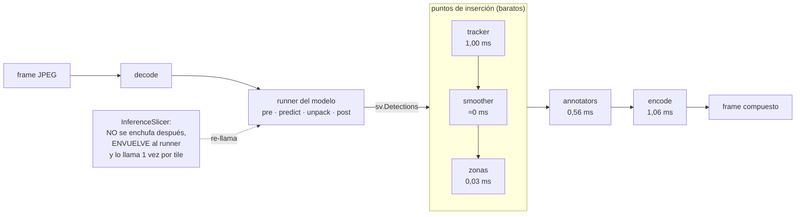

# Catálogo de supervision — lo que queda por cosechar

**Fecha:** 2026-08-27 · **supervision 0.30.1** · mediciones sobre `yolov7-tiny`, frame de
860×573 con 6 detecciones, GPU.

Inventario de todo lo que supervision habilita en UNCaLens **después** del paso 3 (render
en el backend, 2026-08-26). Cada entrada dice qué es, dónde se enchufa, para qué sirve *en
este sistema* y qué cuesta medido, no estimado.

> **Ya implementado del catálogo original** (2026-08-27, ver CLAUDE.md §7): grosor y escala
> de texto adaptativos, etiquetas que se esquivan (`smart_position`) y cuatro estilos de
> marca (`box`/`round`/`corner`/`dot`), los tres manejables desde el panel **Render** del
> cliente. Este documento cubre **lo que falta**.
>
> **Tier B hecho** (2026-08-27, segunda tanda): la superficie de control de sesión (§7),
> **tracking**, **suavizado** y **trazas**, backend **y** cliente (sección `Seguimiento` en
> la columna derecha de Inferencia). Las secciones 4.1, 4.2 y 4.3 quedan cerradas; del
> Tier B siguen abiertas las **zonas** (§4.4), las **líneas de conteo** (§4.5) y el **mapa
> de calor** (§4.6).

---

## 1. Con qué criterio se juzga cada adición

UNCaLens no es una app de vigilancia: es un **banco de pruebas para modelos descritos por
JSON**, usado por un investigador que quiere ver qué hace su modelo y por un integrador
que acaba de enchufar uno nuevo. El criterio no es "¿supervision lo trae?" sino
**"¿esto ayuda a entender el modelo que estoy mirando, o a compararlo con otro?"**. Varias
piezas famosas de supervision existen para construir productos de conteo y analítica, y
para nosotros son un desvío por más lindas que se vean en el demo.

El segundo criterio es el costo, y ahí hay un dato medido que cambia el orden de
prioridades: **dibujar ya no es lo caro**.

| Etapa del frame compuesto | ms |
|---|---|
| anotar (cajas + etiquetas) | 0,56 |
| **comprimir el JPEG** | **1,06** |
| resto (copia, armado) | 0,24 |
| **total** | **1,86** |

El peaje caro —el re-encode— ya se paga desde el paso 3. Sumar annotators encima es
prácticamente gratis. Lo que cuesta de verdad en lo que queda es **estado** (memoria entre
frames, con su ciclo de vida) o **inferencia extra**.

## 2. Dos clases de adición, no quince



Casi todo lo que ofrece supervision entra en el recuadro: recibe el `sv.Detections` que ya
producimos y devuelve algo para dibujar. Cuesta décimas de milisegundo y no toca el modelo.
La única que rompe el molde es `InferenceSlicer`, que se pone **antes** y multiplica el
costo de inferencia.

---

## 3. Tier A — lo que queda de pintura

### 3.1 Etiquetas con acentos y ñ · `sv.RichLabelAnnotator`

**Qué es.** El mismo anotador de etiquetas pero dibujado con PIL y una tipografía real, en
vez de la fuente vectorial Hershey que trae OpenCV.

**Cómo se ve acá.** Requiere un `.ttf` en el repo. Hoy empaquetamos JetBrains Mono y Space
Grotesk pero **sólo en `.woff2`**, que PIL no lee: habría que sumar el TTF de JetBrains
Mono (~200 KB) al lado de los woff2 del cliente, y elegir el annotator de etiquetas según
si el `label_map` tiene caracteres fuera de ASCII.

**Por qué acá.** El `label_map` lo escribe el usuario en el JSON del modelo, y este es un
proyecto en español: el primer `label_map` casero va a tener *camión*, *señal*, *año*. La
fuente Hershey no tiene esos glifos y los dibuja como signos raros o los come. Es un bug
esperando a que alguien cargue un modelo propio — justo el caso de uso que el sistema
promete.

**Costo.** Sin medir (pasa por PIL; del orden del `LabelAnnotator` normal, algo más caro).
Cuesta 200 KB de repo.

**Veredicto.** Sí, pero recién cuando exista el primer `label_map` en español. Queda
anotado para no diagnosticarlo de cero el día que aparezca.

### 3.2 Difuminar o pixelar · `sv.BlurAnnotator` / `sv.PixelateAnnotator` — **DESCARTADO**

Reemplazan el contenido de cada caja por una versión borrosa o pixelada (anonimizar caras
y patentes). **Descartado el 2026-08-26 por decisión del usuario**, con dos razones: es una
función de producto de privacidad, no de banco de pruebas, y tiene un contrasentido acá —
destruye justamente el píxel que el usuario quiere mirar para juzgar si el modelo acertó.

Se reabre sólo si la app se apunta a una cámara del campus y se muestran resultados en
público. Costo medido por si ese día llega: **+1,80 ms**.

---

## 4. Tier B — lo que exige memoria entre frames

El costo acá no es CPU —todo esto es barato— sino **ciclo de vida**. Son piezas que
recuerdan el frame anterior, y hoy no tenemos dónde poner esa memoria: el
`ModelController` es un singleton de proceso y las imágenes fijas abren un WebSocket
efímero por consulta. Antes de la primera línea hay que responder tres preguntas: dónde
vive el estado, cuándo se resetea, y qué pasa con la fuente estática (ver §6).

### 4.1 Tracking · `trackers.ByteTrackTracker` — **1,00 ms/frame**

**Qué es.** Asocia las detecciones de este frame con las del anterior y le pone a cada
objeto un `tracker_id` estable mientras siga en escena. No mira la imagen: trabaja sobre
las cajas, prediciendo dónde debería estar cada objeto y emparejando por solapamiento.

**⚠️ Ojo con la versión.** `sv.ByteTrack` está **deprecado desde la 0.28 y se elimina en la
0.31**. El reemplazo vive en el paquete `trackers` de Roboflow (`pip install trackers`) y
el método pasa de `update_with_detections()` a `update()`. Verificado: **no arrastra ni una
dependencia nueva**, todo lo que pide ya lo trajo supervision.

**Por qué acá.** Por sí solo agrega poco a un banco de pruebas —un número arriba de la
caja—. Vale por lo que **desbloquea**: suavizado, trazas y conteo por línea lo necesitan sí
o sí. Y tiene un uso propio: con IDs estables se puede responder *"¿mi modelo pierde el
objeto entre frames o lo detecta siempre?"*, que es una pregunta de calidad de modelo que
hoy no podemos contestar mirando el feed.

**Riesgos.** Necesita frames en orden y de la misma escena. Nuestro stream cumple (un frame
en vuelo, secuencial), pero hay que apagarlo en el camino one-shot de imágenes y resetearlo
al cambiar de modelo o de fuente, o el tracker "ve" objetos que saltan de una foto a otra.

**Veredicto.** Sí, como cimiento del Tier B. No hacerlo solo: junto con el suavizado, que
es el que se nota.

> ✅ **HECHO el 2026-08-27** (`render/session.py`). **Costo real: 0,54 ms/frame**, la mitad
> de lo estimado acá. Tres hallazgos que este documento no anticipaba:
>
> **(a)** Los defaults del paquete (`track_activation_threshold=0.7`,
> `high_conf_det_threshold=0.6`) hacen que el tracking **no haga absolutamente nada** con
> los tres modelos del repo, cuyos umbrales son 0,5 / 0,3 / 0,25: una detección por debajo
> de esos valores nunca recibe `tracker_id`. El que bloquea es `high_conf_det_threshold`
> — bajar sólo `track_activation_threshold` **no alcanza** (verificado). Ambos se derivan
> ahora del umbral del usuario, y la razón de fondo es estructural: **nuestro postprocesador
> ya descartó la banda de baja confianza** que ByteTrack usa en su segunda pasada, así que
> esa capa llega vacía por construcción y no hay nada que perder al aplanarla.
>
> **(b)** El tracker **no descarta detecciones**: entran N y salen N, y las no confirmadas
> salen con `tracker_id = -1`. Prender el tracking no puede hacer desaparecer una caja.
>
> **(c)** `reset()` existe y devuelve el tracker a estado virgen (ids desde 0).

### 4.2 Suavizado · `sv.DetectionsSmoother` — **≈0 ms** · requiere `tracker_id`

**Qué es.** Promedia la posición de cada objeto en los últimos *n* frames usando su
`tracker_id`. La caja deja de vibrar y se mueve de forma continua.

**Confirmado leyendo el código:** si las detecciones no traen `tracker_id`, **no suaviza y
avisa** — no falla en silencio, pero tampoco hace nada.

**Por qué acá.** Es, de todo lo que queda, **lo que más cambia la sensación de la app**
mirando video. El temblequeo entre frames es el artefacto más visible de cualquier
detector y hace parecer inestable a un modelo que está bien.

**Contracara honesta:** estás *maquillando* al modelo. En un banco de pruebas eso puede ser
exactamente lo que no querés. Por eso va como toggle **apagado por defecto** y con etiqueta
clara ("suavizado n=5", no "mejorar detección"): el usuario tiene que saber que ve un
promedio, no la salida cruda.

> ✅ **HECHO el 2026-08-27.** **No es ≈0 ms: cuesta +0,48 ms/frame** (el bucket `track_ms`
> pasa de 0,55 a 1,03). Y la contracara es más concreta de lo que decía este documento: el
> promedio **arrastra la caja por detrás del objeto** en movimiento sostenido — medido,
> ~13 px con `n=5` sobre algo que avanza 5 px/frame. No sólo quita temblor: **agrega
> retardo**, y eso es lo que la UI tiene que comunicar.
>
> ⚠️ **El bug que hay que conocer si se toca esto.** `sv.DetectionsSmoother` agrupa por
> `tracker_id`, y **todos** los tracks sin confirmar comparten el valor `-1`: para el
> suavizador son el mismo objeto. Verificado: dos detecciones separadas con `tracker_id=-1`
> entran y sale **UNA sola caja**, promediada entre ambas, en un punto de la imagen donde no
> hay nada (entran 2, sale 1). Por eso las detecciones se **parten** antes de suavizar y se
> reúnen después (`StreamSession._con_identidad`). El aviso que este documento celebraba
> —"no suaviza y avisa"— sólo cubre el caso `tracker_id = None`, **no el `-1`**.

### 4.3 Trazas · `sv.TraceAnnotator` — **+1,02 ms** · requiere `tracker_id`

**Qué es.** Dibuja la estela del recorrido de cada objeto rastreado sobre los últimos *n*
frames.

**Por qué acá.** Como herramienta de diagnóstico sirve más de lo que parece: una traza que
salta de un objeto a otro muestra a simple vista que el tracker confunde identidades, y una
traza entrecortada muestra que el detector pierde el objeto en algunos frames. Es la forma
más rápida de **ver** la estabilidad temporal de un modelo, que en números es aburrida y en
pantalla es obvia.

**Veredicto.** Sí, junto con el tracking, como toggle. Es el modo "inspección temporal".

> ✅ **HECHO el 2026-08-27.** **+0,3 ms**, un tercio de lo estimado. Cae en el bucket
> `draw_ms` y no en `track_ms`, porque se dibuja dentro de `render_detection`.
>
> Dos cosas que este documento no anticipaba: **sin `tracker_id` el annotator no avisa,
> levanta `ValueError`** y rompe el frame — por eso la dependencia con el tracking se fuerza
> en el singleton y no sólo en la UI; y **agrupa por `tracker_id` igual que el smoother**,
> así que los `-1` dibujarían una estela saltando de un objeto a otro: justo el artefacto
> que el usuario debería leer como "el tracker confunde identidades". Un artefacto que
> **imita al bug que la herramienta sirve para detectar** es peor que no tener la
> herramienta, así que las trazas también pasan por `_con_identidad`.
>
> Confirmado el valor de diagnóstico que este documento le atribuía: sobre una traslación
> horizontal **perfectamente recta**, la estela sale ondulada — el temblequeo del detector
> hecho visible sin mirar un solo número.

### 4.4 Zonas poligonales · `sv.PolygonZone` — **0,03 ms** · NO requiere tracking

> ✅ **HECHO el 2026-09-09.** Medido en el sistema real: **~0,07 ms por zona** con 70
> detecciones (incluye el test de pertenencia Y el `PolygonZoneAnnotator`), y **escala con
> la cantidad de ZONAS, no con la de detecciones ni con la de vértices** — 16 vértices
> cuestan lo mismo que 4, porque la máscara se rasteriza una vez al construir la zona.
> Este apartado acertaba en todo salvo en una cosa: decía "el backend es trivial", y lo
> caro no fue sólo el editor. La decisión de diseño más costosa fue **dónde vive la
> geometría** — el payload que este catálogo proponía metía las zonas junto al tracking, y
> eso las habría borrado al cambiar de modelo, que es justo el caso de uso que las
> justifica. `StreamSession` tuvo que partirse en dos cajones. Ver
> `docs/superpowers/specs/2026-08-28-zonas-y-lineas-de-conteo-design.md` §3 y §10.

**Qué es.** Un polígono sobre la escena que responde, frame a frame, cuántas detecciones
están adentro y cuáles. `PolygonZoneAnnotator` lo pinta con su contador.

**Cómo se ve acá.** El backend es trivial. Lo caro es el cliente: hay que **dibujar el
polígono sobre el feed** (clicks sobre el canvas, vértices arrastrables, cerrar la figura) y
mandarlo en coordenadas de la **imagen original**, no del canvas escalado. Eso es un editor,
no un toggle.

**Por qué acá.** Verificado: **no necesita tracking** — la ocupación instantánea ("hay 3
adentro") sale gratis; sólo el conteo de cruces necesita identidad. Uso legítimo para el
banco: acotar la evaluación a la región que importa ("ignorá la vereda de enfrente y decime
qué tal anda el modelo en el carril").

### 4.5 Líneas de conteo · `sv.LineZone` — **0,05 ms** · requiere `tracker_id`

> ⛔ **DESCARTADAS el 2026-09-09 por decisión del usuario**, y no por costo: *"estaríamos
> dándole demasiadas perillas al sistema"*. El apartado de abajo se corrigió el 2026-08-28
> por juzgarlas contra un objetivo de menos, y esa corrección **sigue siendo válida**: bajo
> el objetivo educativo las líneas sí aportan valor. Lo que cambió no es el valor sino el
> **precio en superficie de control** — y en el medio la zona aprendió a contar
> (`zone_total`), así que lo único que la línea seguía aportando en exclusiva es la
> **dirección** del cruce. Eso solo no paga otro editor, otro modo, otro contador y otro
> bloque de panel en una columna de 230 px.
>
> **La lección para el resto del catálogo**: además de las dos preguntas de valor (¿mide al
> modelo? ¿hace visible lo que hace?) hay una tercera, de costo, que este documento no
> tenía escrita: **¿cuántos controles nuevos le agrega a la app?** Una feature valiosa
> puede no entrar igual, y varias features valiosas seguidas se pagan entre todas.

**Qué es.** Un segmento que cuenta cuántos objetos lo cruzaron en cada sentido; la variante
`LineZoneAnnotatorMulticlass` lleva un contador por clase.

**Por qué acá.** > 🔴 **CORREGIDO el 2026-08-28.** Este apartado decía que las líneas eran
> "lo **menos alineado** de todo el catálogo con lo que UNCaLens es", con veredicto "sólo si
> aparece la necesidad de *mostrar* la app". **Ese juicio estaba mal fundado** y el usuario lo
> corrigió: partía de asumir un único objetivo, el banco de pruebas. UNCaLens **también tiene
> un objetivo educativo declarado** — mostrar las capacidades de la IA a alguien que no sabe
> de IA. Bajo ese objetivo, "no dice nada sobre el modelo, dice algo sobre la escena" **deja
> de ser una objeción**: que la app cuente autos cruzando una línea en vivo es precisamente
> la clase de cosa que vuelve legible lo que el modelo está haciendo. El texto viejo se
> conserva acá arriba, tachado en espíritu, porque la lección no es sobre las líneas: es que
> **este catálogo juzga contra los objetivos que tiene escritos**, y tenía uno de menos.

Hay que pesar **dos** objetivos, no uno: (a) ¿mide o diagnostica al modelo? y (b) ¿hace
visible lo que el modelo hace, para alguien de afuera? Una feature que sólo cumple (b) es
legítima.

**Veredicto.** **Va.** Junto con las zonas (§4.4), es el par que cumple (b) mejor que
cualquier otra cosa del catálogo, y cuesta 0,05 ms. Su dependencia real no es de prioridad
sino técnica: **exige `tracker_id`**, así que hereda el Tier B entero — incluida la regla de
filtrar los `-1` antes de contar, sin la cual todos los tracks sin confirmar son el mismo
objeto y el contador cuenta ficción.

### 4.6 Mapa de calor · `sv.HeatMapAnnotator` — **+6,93 ms/frame**

**Qué es.** Acumula las posiciones de las detecciones a lo largo del tiempo y las pinta
como mancha de calor sobre el frame. Guarda una matriz del tamaño del frame entre llamadas:
hay que resetearla al cambiar de fuente o el calor de un video queda pintado sobre el
siguiente.

**Por qué acá.** Uso honesto: sobre un video de prueba muestra **dónde** detecta el modelo,
y por lo tanto dónde no. Si el calor se concentra siempre en el centro, tenés un modelo con
sesgo de posición o un letterbox mal configurado — diagnóstico difícil de obtener de otra
manera.

**Costo.** Casi cuatro veces el render completo actual y el único de la lista que se siente:
con inferencia de 7,3 ms, prenderlo casi duplica el trabajo del backend por frame.

**Veredicto.** Opcional y apagado. Aceptable como modo de análisis sobre archivo; malo como
algo que alguien pueda dejar prendido sin darse cuenta en cámara en vivo.

---

## 5. Tier C — lo que cambia qué es la aplicación

### 5.1 Inferencia por tiles (SAHI) · `sv.InferenceSlicer` — **2× a 12× inferencia**

**Qué es.** Corta la imagen en tiles con solapamiento, corre el modelo en cada uno y fusiona
con NMS. Sirve para objetos chicos: un modelo de 640×640 que recibe una foto de 4000 px ve
cada objeto reducido a unos pocos píxeles; con recortes de 640 los ve en su tamaño real.

**Cómo se ve acá.** Es el **premio directo del paso 2**: el callback que pide es
`imagen → sv.Detections`, que es exactamente la firma de nuestro runner. La integración es
pasar `controller.inference` como callback — literalmente eso (probado para medirlo).

**Costo medido**, sobre `horses.jpg`:

| modo | tiempo | cajas |
|---|---|---|
| directo | 14 ms | 6 |
| `slice_wh=640` (4 tiles) | 29 ms | 7 |
| `slice_wh=320` (12 tiles) | 165 ms | **3** |

**La trampa.** No es una mejora gratuita de calidad. Con tiles de 320 el resultado fue
**peor**: los caballos son más grandes que el tile y quedan partidos en pedazos que el
modelo ya no reconoce. El slicing ayuda a los objetos chicos y **perjudica** a los grandes.
Tiene que ser una opción explícita con su tamaño de tile a la vista, **jamás un default**.

**Veredicto.** Sí, sólo para la fuente **imagen**, que ya es one-shot y no tiene presupuesto
de tiempo real. En cámara o video es inviable a 30 fps.

### 5.2 Exportar detecciones · `sv.CSVSink` / `sv.JSONSink`

> ✅ **HECHO el 2026-09-09.** Se usó el **parseador** de `sv.JSONSink`
> (`parse_detection_data`) pero **no el sink**: el de supervision acumula todas las filas en
> memoria y las vuelca al cerrar, y con ~70 detecciones por frame eso son ~250.000 filas en
> dos minutos. El archivo se escribe **incrementalmente**. Dos cosas que este apartado no
> anticipaba: (a) el `tracker_id` sale como **string vacío** cuando no hay tracking —
> correcto en CSV, mentira de tipo en JSON — y se normaliza a `null`; (b) el trabajo de
> producto que el apartado marcaba como "el trabajo real" se resolvió partiendo el canal:
> **abrir y cerrar por el WebSocket** (el archivo es de esa conexión) y **bajarlo por HTTP**
> (puede pesar megabytes). Ver §7 de `CLAUDE.md`, tanda del 2026-09-09.

**Qué es.** Escritores que vuelcan las detecciones de cada frame a CSV o JSON, con sus
campos y los datos extra que lleve el `sv.Detections`.

**Por qué acá.** Esto **devuelve algo que el paso 3 se llevó**. El spec lo anotó como riesgo
3: al mandar el frame ya compuesto, el cliente dejó de recibir los números y sólo ve
píxeles. Para un investigador ese dato es el producto — quiere las cajas en una planilla
para contarlas, graficarlas o compararlas. La solución no es volver a mandar JSON al
cliente: es exportarlo desde donde ahora vive.

**Costo.** I/O por frame, despreciable frente a la inferencia. El trabajo real es de
producto: dónde se guarda el archivo, cómo se llama, cómo se lo lleva el usuario.

**Veredicto.** Sí, alta prioridad dentro del Tier C. Barato, cierra una deuda conocida y es
lo primero que va a pedir alguien que use la app para trabajar.

### 5.3 Métricas sobre un dataset · `sv.DetectionDataset` + `sv.metrics`

**Qué es.** El aparato de evaluación completo: `from_coco` / `from_yolo` / `from_pascal_voc`
para cargar un dataset con sus anotaciones, y `MeanAveragePrecision`, `Precision`, `Recall`,
`F1Score`, `MeanAverageRecall` y `ConfusionMatrix` para medir — global y por clase.

**Cómo se ve acá.** Una vista nueva al lado de Inferencia y Modelos: elegir carpeta de
dataset, elegir modelo cargado, correr, ver el reporte. El pipeline ya tiene todo lo
necesario; falta el recorrido batch (con progreso, cancelación y manejo de errores por
imagen), el reporte y la UI.

**Por qué acá.** Es **el salto de valor más grande** para un contexto universitario. Hoy
UNCaLens contesta "¿qué hace este modelo?"; con esto contesta *"¿cuál de estos dos modelos
es mejor, y en qué clases?"*, que es la pregunta de una tesis, una cátedra o cualquier
decisión técnica real. También convierte al wizard de configs en algo más que comodidad: si
el JSON está mal, el mAP lo grita con un número.

**Costo.** El más caro del documento, y no por CPU.

**Veredicto.** El norte, si el objetivo es académico.

### 5.4 Comparar dos modelos en el mismo frame · `sv.ComparisonAnnotator`

**Qué es.** Un anotador hecho para superponer **dos conjuntos** de detecciones sobre la
misma imagen: un color para lo que encontró el primero, otro para el segundo, un tercero
para lo que encontraron ambos.

**Cómo se ve acá.** Exige lo único que la arquitectura hoy no permite: **dos modelos
cargados a la vez**. El `ModelController` es un manager de *un* pipeline por diseño. Habría
que pasar a un registro de pipelines con un modelo "A" y uno "B", y decidir qué hace
`/metrics` con dos.

**Por qué acá.** Es la funcionalidad **más alineada con lo que el nombre de la app
promete**. Un banco de pruebas que muestra, sobre el mismo frame, qué ve YOLOv7 que no ve
EfficientDet —y qué ven los dos— es una herramienta con identidad propia, no una app de
detección más. Y ese diff visual es exactamente lo que se pone en una presentación.

**Costo.** El anotado es barato; lo caro es la refactorización del controller y el doble de
inferencia por frame.

**Veredicto.** El candidato ambicioso: más caro que el Tier A, más barato que el aparato de
métricas, y el que más cambia lo que la app *es* por unidad de trabajo.

### 5.5 Grabar desde el backend · `sv.VideoSink` / `sv.ImageSink` — **descartado con motivo**

Hoy la grabación la hace el cliente con `MediaRecorder` sobre el canvas, y desde el paso 3
ese canvas ya tiene el dibujo del backend: **la grabación actual funciona bien**. Mover el
grabado al backend sólo compraría independencia del navegador y un archivo con calidad
controlada; ninguna de las dos es una necesidad que hoy exista. Se deja constancia de que se
evaluó.

---

## 6. Lo que supervision trae y acá no aplica

| Pieza | Qué hace | Por qué no |
|---|---|---|
| `VertexAnnotator`, `EdgeAnnotator`, `VertexLabelAnnotator` | Esqueletos y puntos clave de modelos de pose | Necesitan un pipeline de *keypoints*, que no existe: sería un `model_type` nuevo entero con su unpacker y su contrato. No es una adición, es otro proyecto |
| `OrientedBoxAnnotator` | Cajas rotadas (modelos OBB) | Ningún unpacker nuestro produce cajas rotadas y el formato interno `[x1,y1,x2,y2]` no las representa |
| `sv.FPSMonitor` | Mide fotogramas por segundo | Ya lo tenemos, y mejor: el `PerfMeter` desglosa pre / inferencia / post / dibujo |
| `with_nms`, `box_non_max_merge`, soft-NMS, `OverlapFilter` | Variantes de supresión y fusión de cajas | Nuestro NMS está probado y atado a rarezas por formato (`tflite_detpost` ya trae NMS y lo desactivamos a propósito). Decidido en el spec del paso 3. *Excepción*: la fusión entre tiles del slicer la hace supervision internamente, y está bien |
| `process_video`, `get_video_frames_generator` | Leen un video frame a frame | El cliente ya abre el video y manda los frames; traerlo al backend duplicaría la fuente de verdad de qué se está mirando |
| `sv.LMM`, `sv.VLM` | Conectores a modelos de lenguaje-visión | Fuera de alcance: UNCaLens corre modelos locales descritos por JSON, no llama a servicios de terceros |
| `CropAnnotator`, `IconAnnotator`, `BackgroundOverlayAnnotator`, `PercentageBarAnnotator` | Efectos: recortes ampliados, íconos por clase, fondo atenuado, barra de confianza | No por malos sino por ruido: cada uno es una opción más en la UI. Si el selector de estilos escala bien, entran solos más adelante |

---

## 7. La superficie de control: lo que falta definir

Hay **tres dueños** de ajustes, con tres vidas distintas, y meterlos en el mismo lugar es la
forma más rápida de repetir la inflación que el wizard de modelos ya tuvo que podar.

| Dueño | Vive en | Ejemplos | Cuándo muere |
|---|---|---|---|
| **Usuario** | `localStorage` → `POST /config/draw` → singleton de proceso | colores, estilo de caja, grosor auto/manual, calidad JPEG | Nunca: sobrevive al modelo, a la fuente y al reinicio |
| **Modelo** | `configs/<modelo>.json` (schema estricto, wizard) | `label_map`, umbral, NMS, tile sugerido del slicer | Se recarga con el modelo |
| **Sesión** | La conexión del stream — **hoy no existe** | tracking, suavizado, trazas, zonas dibujadas, mapa de calor | Al cambiar de modelo o de fuente |

**Estado al 2026-08-27 (segunda tanda): resuelto, con una corrección a la tabla de arriba.**

Este documento proponía un **tercer dueño** de ajustes ("sesión") con su propio endpoint
`/config/render`. Al implementarlo se vio que la taxonomía estaba mal cortada: **que el
tracking esté prendido es una preferencia del usuario** — sobrevive al modelo, a la fuente
y al reinicio, igual que el color de caja. Lo que muere con la sesión **no es el toggle, es
la memoria**: el objeto tracker con sus filtros, el deque del smoother, el buffer de
recorridos.

Separadas esas dos cosas, el tercer dueño desaparece y con él el endpoint nuevo. Los toggles
se sumaron a `DrawConfig` y a `POST /config/draw` (regla 2 cumplida, y sin migrar el
cliente); la memoria vive en `render/session.py`, **colgada de la conexión del WebSocket**.

Ese dueño resuelve de forma **estructural** tres de los cuatro casos de reseteo —cambio de
fuente, reconexión y foto suelta cierran la conexión o nunca la abren— sin que nadie tenga
que acordarse de llamar a nada. El cuarto es el que importa: **cambiar de modelo NO cierra
el WebSocket** (el effect del cliente depende de la fuente, no del modelo). Se resuelve con
un contador de generación en el `ModelController`: la sesión recuerda bajo cuál nació,
compara una vez por frame y se olvida sola. Es el mismo truco que la `version` de
`DrawConfig` con el cache de annotators, y por la misma razón — se auto-repara, en vez de
exigir que el endpoint REST le avise a cada conexión viva.

**Corrección al alcance de "sesión" (2026-08-28), antes de implementar zonas.** La forma
propuesta del payload (más abajo) mete `zones` adentro de `session`, junto al tracking. Eso
es un error: **`StreamSession` se resetea por `pipeline_generation`, o sea al cambiar de
modelo**, y una zona NO debe morir cuando cambia el modelo — el polígono describe *la
escena*, y comparar dos modelos sobre la misma zona es exactamente el caso de uso del banco
de pruebas. Zonas y líneas tienen **vidas distintas entre sí**, aunque se dibujen parecido:

| Objeto | Muere cuando | Por qué |
|---|---|---|
| **Zona** (el polígono) | cambia la **fuente** | Describe la escena. Si cambia el video, el polígono no significa nada. Sobrevive al cambio de modelo. |
| **Contador de la línea** | se reinicia el **tracker** (o sea, también al cambiar de modelo) | Cuenta cruces por `tracker_id`. Si las identidades se reinician y el contador no, cuenta doble. |

O sea que la geometría y el conteo no son el mismo estado y no pueden colgar del mismo
dueño: la **geometría** de ambas (polígono y segmento) vive atada a la fuente; el **contador**
de la línea vive atado al tracker.

La **regla 3** (dependencias visibles) se cumple en el **singleton**, no en la UI:
`smoothing` y `traces` prenden el tracking solos, y apagar el tracking los apaga. Como es la
única puerta de escritura del estado, no existe forma de dejarlo en una combinación
imposible, la valide quien la valide. El endpoint devuelve el estado efectivo para que el
cliente pueda mostrar lo que realmente pasó.

### Cuatro reglas antes de dibujar ningún botón nuevo

1. **Si no se ve en el feed, no es un botón.** Va al JSON del modelo o queda como constante.
2. **Un solo endpoint declarativo, no uno por función.** `/config/draw` ya existe y ya es en
   vivo; extenderlo evita que cada toggle nuevo agregue una ruta.
3. **Las dependencias se muestran, no se adivinan.** Suavizado, trazas y líneas de conteo
   *exigen* tracking. Si el usuario prende uno con el tracking apagado, la UI tiene que
   mostrarlo atado (prender tracking solo, con un "requiere seguimiento" visible). Lo que no
   puede pasar es que el toggle quede prendido sin hacer nada — que es exactamente lo que
   hace el smoother de supervision cuando le falta el `tracker_id`.
4. **El backend resetea, el cliente no recuerda.** Al cambiar de modelo o de fuente, el
   estado de sesión se tira. Y el camino one-shot de imágenes **nunca** crea tracker: son
   fotos sueltas, no una secuencia.

### Forma propuesta del payload

```jsonc
POST /config/render
{
  "draw": {                     // del usuario · persiste  (YA IMPLEMENTADO como /config/draw)
    "bboxColor": "#00BFFF",
    "labelColor": "#001018",
    "boxStyle": "corner",       // box | round | corner | dot
    "smartLabels": true,
    "autoScale": true,          // grosor y textScale derivados de la resolución
    "jpegQuality": 85
  },
  "session": {                  // muere con el modelo o la fuente  (PENDIENTE)
    "tracking":  { "enabled": true },
    "smoothing": { "enabled": true, "length": 5 },   // requiere tracking
    "traces":    { "enabled": false, "length": 30 }, // requiere tracking
    "heatmap":   { "enabled": false },
    "zones":     []             // polígonos en px de la imagen original
  }
}
```

La respuesta devuelve el **estado efectivo**, no el pedido, para que el cliente pueda
mostrar que el tracking se prendió solo porque lo pedía el suavizado. `422` cuando el pedido
es imposible, igual que hoy con un color inválido. (El endpoint actual ya devuelve el estado
efectivo completo.)

---

## 8. Orden sugerido

1. ~~**Tier A, sin el blur**~~ → **HECHO el 2026-08-27**: escala adaptativa, etiquetas que
   se esquivan y cuatro estilos de marca, con su panel en el cliente.
2. ~~**La superficie de control (estado de sesión).** Hacerlo *antes* del Tier B: si el
   tracking llega primero, su estado se acomoda donde entre y después se paga el doble.~~
   → **HECHO el 2026-08-27**, y el consejo era correcto. Se montó y verificó el andamiaje
   **vacío** (`StreamSession` + contador de generación, con tests propios) antes de colgarle
   el primer tracker, así el reseteo se probó sin que se mezclara con el comportamiento de
   una librería.
3. ~~**Tracking y suavizado, juntos** (con el paquete `trackers`, no con el `ByteTrack`
   deprecado). Las trazas salen casi gratis en el mismo viaje.~~ → **HECHO el 2026-08-27**
   backend **y** cliente, trazas incluidas: **~1,3 ms/frame** con los tres prendidos. El
   panel `Seguimiento` va **aparte** de `Render` (gobierna el eje del tiempo, no el del
   pintado), con los dependientes indentados bajo el maestro y el bloque deshabilitado
   cuando la fuente es una imagen fija.
4. **Exportar detecciones.** Barato y le devuelve al usuario el dato numérico que el paso 3
   se llevó al backend.
5. **Zonas y líneas de conteo** (§4.4, §4.5). **Ya no son una rama condicional de la
   bifurcación**: el objetivo educativo del sistema está declarado, así que dejaron de
   depender de que "aparezca la necesidad de mostrar la app" (ver la corrección del
   2026-08-28 en §4.5). Van en este orden y no al revés: **la zona no necesita tracking y la
   línea sí**, así que la zona se puede montar y verificar sola, y encima trae consigo la
   pieza cara que las dos comparten —el editor de polígonos del cliente y su transformación
   de coordenadas—, que la línea después reusa con dos vértices en vez de N.
6. **La bifurcación** que queda, según el objetivo:
   - académico → **métricas sobre dataset** (§5.3);
   - imágenes grandes → **el slicer** (§5.1);
   - identidad propia → **comparar dos modelos** (§5.4).

**Segmentación** queda fuera de este documento a propósito. Cuando entre, dos cosas la
esperan hechas: el `MaskAnnotator` ya está construido en `render/annotators.py` con el
`maskAlpha` del usuario, y el camino de salida binario del WS no distingue entre cajas y
máscaras. Lo que falta es el unpacker y el decodificado de la máscara — trabajo de pipeline,
no de supervision.
